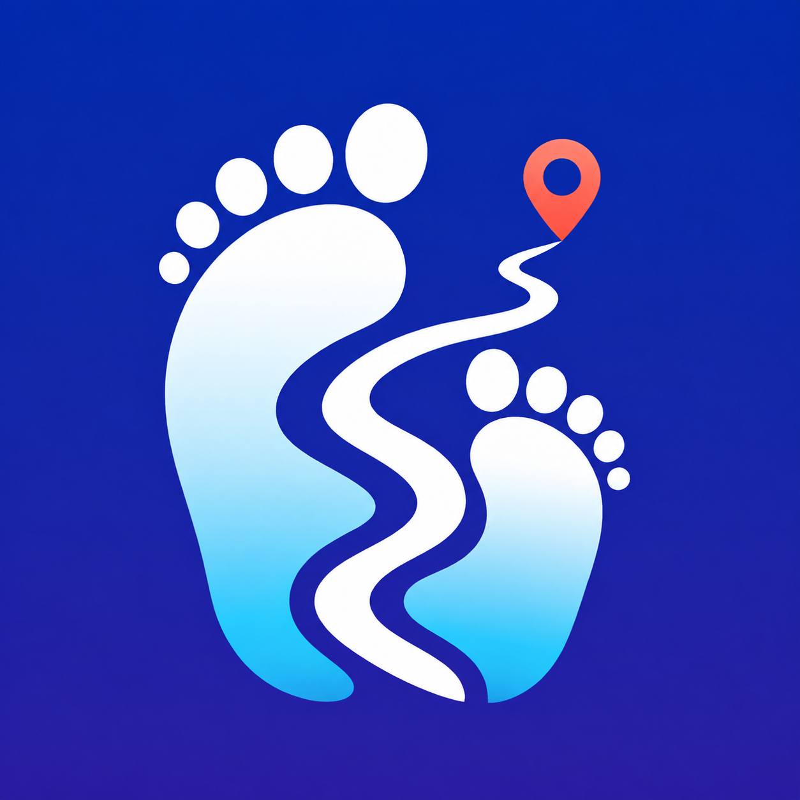
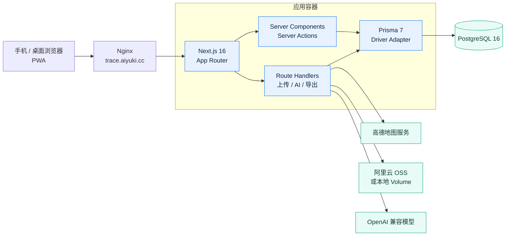

<p align="center">
  
</p>

<h1 align="center">Trace · 带娃旅行记</h1>

<p align="center">把一家人的路线、花费、照片、宝宝状态与沿途回忆，收进同一条时间线。</p>

## 项目简介

Trace 是一个移动端优先的家庭旅行记录应用。它不是出发前的行程规划器，而是旅途中的随身记录本：到达一站、吃了一餐、打了一辆车、宝宝睡着了，都可以快速记下；回家后再通过地图、账本、照片墙和总结长图重温整段旅程。

界面采用接近 Apple 平台的分层、圆角与半透明材质，并针对触控反馈、减少动态效果、减少透明度和高对比度偏好做了适配。它同时是一套可安装的 PWA，可在手机桌面独立运行。

## 功能亮点

- 旅程时间线：按天组织地点、交通、住宿、餐食、游玩、购物与随手记。
- 地图足迹：高德地图标记、路线连线、行程回放，以及地图不可用时的 SVG 降级展示。
- 多币种账本：以最小货币单位存储金额，统一折算主币种，支持分类、日均与宝宝相关统计。
- 照片归档：读取 EXIF 时间和 GPS，关联旅程站点；支持照片墙、封面和带鉴权的缩略图。
- 带娃专属：喂奶、换尿布、睡眠记录，月龄展示、婴儿友好标签和出行装备清单。
- AI 助手：全站唯一的悬浮入口。在旅程里可以随口记录、拍照识票据、写游记、生成装备清单；在其他页面则是跨旅程回忆问答（住过哪、花了多少、那年今日）。
- 分享与回顾：可控隐私的免登录分享页、CSV 导出和可保存的旅程总结长图。
- 家人共同记录：邮箱注册登录，旅程所有者一键生成邀请链接，加入的都是可记录的家人；只想给别人看，用只读分享链接。
- AI 结果卡片：写入成功后展示实际记录，可核对金额、时间和地点，直接修改或撤销；已有后续修改或关联记录时阻止误撤销。
- 旅程整理：在旅程「更多 → 旅程整理」打开整理报告，「一键整理」按时间把未关联的记录归到站点并重试照片识别；剩下的重复账单、AI 待核对记录逐条确认。每条记录的卡片里都能看到操作者、来源和修改前后内容。

### 整理与撤销说明

- 重复检测按旅程本地日期、名称、币种、金额匹配，只提示，不自动合并或删除。确认是不同消费后可全部保留；账单变化会重新提示。
- AI 记录可「核对无误」，手动纠正后也会清除待核对状态。AI 撤销仅限发起者或旅程所有者；有家人后续编辑时必须查看最新版本再修改。
- 地点关联属于补充建议，跨站交通可以保持未关联；本设备待同步数量不代表其他设备的离线内容。
- 操作历史覆盖核心地点、条目、花费、照片、宝宝状态和日记的已接入写入路径，在记录卡片里查看，不是全站安全审计；分享访问和旧版数据没有追溯记录。
- 删除记录会保留操作历史，不提供通用删除恢复。整理入口删除照片仅移除数据库记录，原始对象暂留存储；请勿把这当作完整备份方案。
- MCP 接入放在「我 → 开发者选项」里，给 Claude 等外部助手读取旅行记录用，家人日常用不到。
- 本地验证：`pnpm test`；本机 PostgreSQL 集成测试：`RUN_DB_TESTS=1 pnpm test`；移动端整理流程：`pnpm exec playwright test e2e/organize.spec.ts`。数据库测试创建独立夹具并按 ID 清理，不允许连接远程数据库。

## 技术架构



核心技术栈：Next.js 16.3、React 19、TypeScript、Tailwind CSS 4、shadcn/Radix UI、Motion、Prisma 7、PostgreSQL 16、Vercel AI SDK、高德地图与阿里云 OSS。

## 本地开发

环境要求：Node.js 22、pnpm 10、Docker 与 Docker Compose。

```bash
pnpm install
cp .env.example .env
pnpm db:up
pnpm db:migrate
pnpm dev
```

浏览器打开 `http://localhost:3000`。项目没有预置默认用户名或密码；当 `ALLOW_SIGNUP=true` 时，请在 `/signup` 创建第一个账号。生产环境创建完成后建议关闭公开注册。

常用检查：

```bash
pnpm typecheck
pnpm lint
pnpm build
```

## 环境变量

复制 `.env.example` 后按实际环境填写：

| 分类 | 变量 | 说明 |
|---|---|---|
| 数据库 | `DATABASE_URL` | PostgreSQL 连接串 |
| 站点 | `APP_URL`、`APP_PORT` | 对外地址与 Compose 映射端口 |
| 认证 | `AUTH_SECRET`、`ALLOW_SIGNUP` | 会话签名密钥与公开注册开关 |
| 高德地图 | `AMAP_JS_KEY`、`AMAP_SECURITY_CODE`、`AMAP_WEB_SERVICE_KEY` | 浏览器地图（运行时由服务端注入，改 .env 重启即生效）与服务端路径/天气/POI 查询 |
| 对象存储 | `OSS_REGION`、`OSS_BUCKET`、`OSS_ACCESS_KEY_ID`、`OSS_ACCESS_KEY_SECRET` | 图片存储；凭据留空时使用本地 Volume。私有 Bucket 的 `OSS_PUBLIC_BASE_URL` 应留空，由应用鉴权代理读取 |
| AI | `AI_BASE_URL`、`AI_API_KEY`、`AI_MODEL`、`AI_VISION_MODEL` | OpenAI 兼容文本与视觉模型 |

不要提交真实 `.env`、访问密钥或生产数据库口令。

## Docker 部署

项目采用多阶段镜像：`runner` 运行 Next.js standalone 产物，`migrate` 在启动前执行 Prisma migration，PostgreSQL 数据和本地图片使用命名卷持久化。

```bash
docker compose up -d --build
docker compose ps
```

仓库内的 `deploy/deploy.sh` 会在本机为 `linux/amd64` 构建镜像、上传到目标服务器并重启服务：

```bash
deploy/deploy.sh
# 数据库迁移镜像有变化时
deploy/deploy.sh --with-migrate
```

当前生产入口为 `http://trace.aiyuki.cc`，Nginx 回源应用容器映射的 `3100` 端口。正式公开使用前建议配置 HTTPS；PWA 安装、浏览器定位与安全 Cookie 在 HTTPS 下体验更完整。

## 项目结构

```text
src/app/                 页面、Server Actions 与 Route Handlers
src/components/          时间线、地图、账本、AI、分享及基础 UI
src/lib/                 认证、数据库、地图、货币、存储与 AI 工具
prisma/                  Schema 与迁移
public/                  PWA、离线页、品牌与图标资源
animation-plans/         动效审计和优化计划
deploy/                  服务器部署脚本
```

## 设计与动效原则

- 高频导航即时响应，不用装饰性弹簧拖慢操作。
- 按压反馈使用约 160ms、`scale(0.97)`；进入和退出通常不超过 300ms。
- 仅动画 `transform` 与 `opacity`，避免 `transition-all` 和布局属性动画。
- 悬停效果只为精细指针启用，并尊重 `prefers-reduced-motion`、`prefers-reduced-transparency` 与 `prefers-contrast`。

Logo 由 OpenAI 图像生成工具为 Trace 定制：成人与孩子的脚印由一条路径连接到目的地，代表一家人共同走过并被记录下来的旅程。

## License

当前仓库未声明开源许可证。未经项目所有者许可，请勿用于公开分发或商业用途。
